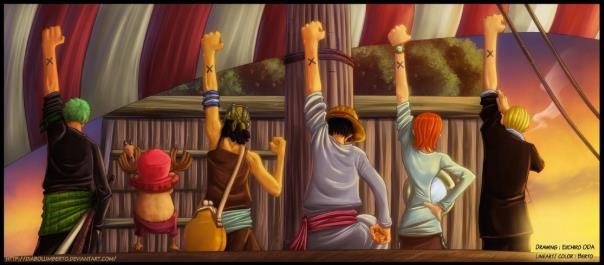

안녕하세요!

미어캣게임즈에서 함께 게임을 개발하고 서비스할 팀원을 모집하고 있습니다.

## 채용 분야

 - 서버 프로그래머
 - 클라이언트 프로그래머
 - 게임 디자이너(전투 기획)
 - (병역특례의 경우 전직 및 보충역으로 지원 가능)

## 프로젝트 소개

 - **로얄 크라운**
   - 장르 : 배틀로얄 MOBA
   - 플랫폼 : PC(Steam)와 모바일 크로스 플랫폼
   - 퍼블리셔 : 라인게임즈
   - [트레일러 동영상](https://youtu.be/siEfvy46dpU)   
 

## 근무 조건 및 복지

 - 근무지 : 서울시 강남역 근처(플래티넘 타워)
 - 연봉제, 4대 보험, 퇴직금, 스톡 옵션, 인센티브
 - **탄력 근무제**(오전 11시까지 자율 출근)
 - **매월 문화비 20만원** 지급 (식대, 음료, 도서, 영화, 공연, 운동, 게임, 장비 구입 등)
 - 설날, 추석, 생일, 결혼기념일 선물 지급 및 오후 4시 퇴근
  - **수요미식회** : 매주 수요일은 다함께 맛집 탐방
 - **커피, 과자, 음료, 과일 등 다양한 간식 무한 제공** – [링크](https://www.facebook.com/meerkatgames/posts/1832764870335521)
 - 도서 구입 지원
 - 야근시 식대, 택시비 지급
 - 각종 경조사 지원금 
 - 정기적, 비정기적 다양한 사내 이벤트
   - [사내 게임잼](https://www.facebook.com/meerkatgames/posts/1784741135137895)
   - [사생대회](https://www.facebook.com/meerkatgames/posts/1710754485869894)
   - [성탄절 이벤트](https://www.facebook.com/meerkatgames/posts/1818936188385056)   
   - Ignite Meerkat

## 회사 소개

미어캣게임즈는 유수의 베테랑 개발자들이 모여 창업한 회사입니다. 모바일 실시간 PVP 게임을 주력으로 개발하고 있으며, <아레나 마스터즈>와 <먼치킨.io> 게임을 서비스하고 있습니다. 현재 차세대 MOBA 게임을 목표로 개발중이며, 향후 다양하고 멋진 게임을 만들어나가는 글로벌 게임 회사로 성장하려 하고 있습니다.

옛날 자료긴 하지만, 미어캣게임즈가 걸어온 길을 좀 더 자세히 알고 싶으시다면 다음 링크의 슬라이드를 참고 바랍니다.

 - [<NDC2015 : 게임 스타트업 시작하기 – 미어캣 게임즈의 사례>](https://www.slideshare.net/birdkr/ndc-2015-48425021)

최근 뉴스

 - [(2018.12.12)라인게임즈, 6종의 모바일-3종의 PC-1종의 콘솔 라인업](http://bbs.ruliweb.com/news/read/116433)
 
 
## 게임 소개
 - 로얄 크라운 (개발중, 2020년 출시)
   - [트레일러 동영상](https://youtu.be/siEfvy46dpU)
 - 먼치킨.io
   - [트레일러 동영상](https://www.youtube.com/watch?v=yhwDDWxUYzQ) 
   - [구글 플레이 링크](https://play.google.com/store/apps/details?id=com.meerkatgames.munchkinio), [앱스토어 링크](https://itunes.apple.com/kr/app/%EB%A8%BC%EC%B9%98%ED%82%A8-io/id1320425776?mt=8)
 - 아레나 마스터즈
   - [트레일러 동영상](https://www.youtube.com/watch?v=UQQpsVrGbbY)
   - [구글 플레이 링크](https://play.google.com/store/apps/details?id=com.meerkatgames.amlegend), [앱스토어 링크](https://itunes.apple.com/kr/app/%EC%95%84%EB%A0%88%EB%82%98-%EB%A7%88%EC%8A%A4%ED%84%B0%EC%A6%88-%EC%A0%84%EC%84%A4%EC%9D%98-%EC%8B%9C%EC%9E%91/id1347879870?mt=8)
 
 
## 우대 사항

 - 스타트업에서 재미있는 일을 해보고 싶으신 분
 - 프로젝트 1개 이상 처음부터 런칭까지 경험해 보신 분
 - 어떤 분야에서든 리더 역할을 해보신 분
 - 유니티로 게임을 출시해 보신 분
 - 개발하는 것 자체를 좋아하시는 분
 - 업무 외적으로 무언가에 깊이 빠져본 경험이 있는 분
 - 새로운 것을 배우고 동료에게 지식을 공유하는 문화를 즐기는 분

## 개발 문화

 - 직급을 따지지 않는 **수평적인 개발 문화**를 지향합니다.
 - **애자일의 원칙과 가치**를 개발 철학으로 삼고 있습니다.
 - 컨퍼런스 참석, 스터디 활동 등 개인의 능력 개발을 장려합니다.
 - **집단적 창의성**을 중요한 가치로 생각하고 있으며, 정기적으로 사내 게임잼 등의 활동을 지원합니다.
 - 일에 몰두하여 **열정적으로 일하는 분위기**를 유지하려고 노력하고 있습니다.
 
## 기술 스택

 - 미어캣게임즈의 모든 프로젝트는 **유니티3D**를 사용하여 제작하고 있습니다.
 - 서버는 **ASP.NET MVC5**를 사용하고 있으며, DB는 **MySQL**과 함께 NoSQL인 **DynamoDB**를 사용하고 있습니다.
 - 모든 서버는 **AWS**로 관리하고 있습니다.
 - 전체 프로세스는 [**스크럼**](https://ko.wikipedia.org/wiki/%EC%8A%A4%ED%81%AC%EB%9F%BC_(%EC%95%A0%EC%9E%90%EC%9D%BC_%EA%B0%9C%EB%B0%9C_%ED%94%84%EB%A1%9C%EC%84%B8%EC%8A%A4))의 방식으로 진행되며 구체적인 일정 관리는 [Jira](https://www.atlassian.com/software/jira)와 [Trello](https://trello.com)를 사용합니다.
 - 소스는 Gitlab으로 관리하고 있습니다.
 - 자동 빌드 시스템은 [Jenkins](https://jenkins.io)를 구축하여 사용하고 있습니다.
 - 문서화는 아틀라시안의 위키 시스템인 [Confluence](https://www.atlassian.com/software/confluence)와 구글 드라이브를 함께 사용합니다.
 - 내부 커뮤니케이션은 [Slack](https://slack.com)을 활용하고 있습니다.
 
## 지원 방법

자기 소개서, 경력기술서 및 포트폴리오를 자유롭게 적어 다음 이메일로 보내주시기 바랍니다. (파일 형식은 PDF 권장)

 - 지원 방법
   - 메일 제목에 채용 분야 명을 기재 후 recruit@meerkatgames.co.kr 로 보내주세요.
 - 제출 서류
   - 자기소개서
   - 경력기술서
   - 포트폴리오 or 샘플 코드(프로그래머)
  
